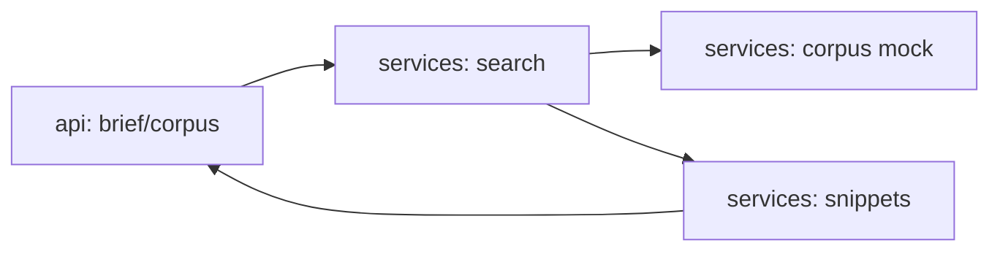

# agent-dev-research

[](https://github.com/Shamanchi/agent-dev-research/actions/workflows/ci.yml)
[](https://www.python.org/)
[](./Dockerfile)
[](./LICENSE)

> **English TL;DR:** FastAPI dev-research agent: searches a mock corpus of READMEs, changelogs, ADRs and issues, then builds a brief with key points, extracted code snippets and a reading list. Fully offline, no tokens needed.

Агент исследований для разработчиков: ищет по mock-корпусу (README, ченджлоги, ADR, issue), собирает бриф с тезисами, извлечёнными код-сниппетами и списком «что почитать». Работает офлайн.

Источник темы: `Hands-On-AI-Engineering / P-119 (devable_research_agent)` — идею и постановку взяли из каталога, код и тексты написаны с нуля.

## Какую задачу решает

Разработчику нужно быстро разобраться в незнакомой теме или библиотеке: агент находит релевантные доки, вытаскивает из них код-примеры и отдаёт бриф — тезисы, сниппеты и очередь чтения.

## Архитектура



Слои: `api/` → `services/` → `core/`, настройки через `pydantic-settings`.

## Быстрый старт

```bash
cp .env.example .env
pip install -r requirements.txt
uvicorn app.main:app --reload
curl -X POST http://127.0.0.1:8000/api/v1/brief -H "Content-Type: application/json" -d "{\"query\": \"caching redis\", \"max_docs\": 2}"
```

Docker:

```bash
docker compose up --build
```

## API

- `GET /api/v1/health` — проверка сервиса.
- `GET /api/v1/corpus?q=caching` — поиск по корпусу без брифа.
- `POST /api/v1/brief` — бриф по запросу. Тело: `{"query": "...", "max_docs": 2}`.

Пример ответа `brief` (сокращённо):

```json
{
  "query": "caching redis",
  "docs": [{"n": 1, "title": "Redis caching ADR", "kind": "adr", "score": 6.5}],
  "key_points": ["Redis caching ADR: cache-aside wins... [1]"],
  "snippets": [{"n": 1, "language": "python", "code": "cache.get(key)"}],
  "brief_md": "# Dev brief: caching redis\n..."
}
```

## Переменные окружения (.env)

| Переменная | Назначение | По умолчанию |
|---|---|---|
| `MAX_DOCS` | Документов в брифе по умолчанию | `3` |
| `MIN_SCORE` | Минимальный скор документа | `1.0` |
| `APP_HOST` / `APP_PORT` | Хост/порт API | `0.0.0.0` / `8000` |

Полный список — в [.env.example](./.env.example).

## Тесты

```bash
pip install -r requirements.txt
pytest -q
pytest -q -m integration
```

Unit-тесты без сети. Интеграционные (`-m integration`) — через TestClient, тоже без сети.

## Контакты

- Telegram: @PavelYrevichh
- Email: Lietman46@mail.ru
- GitHub: Shamanchi
- FL.ru: https://www.fl.ru/users/Shamanchi
